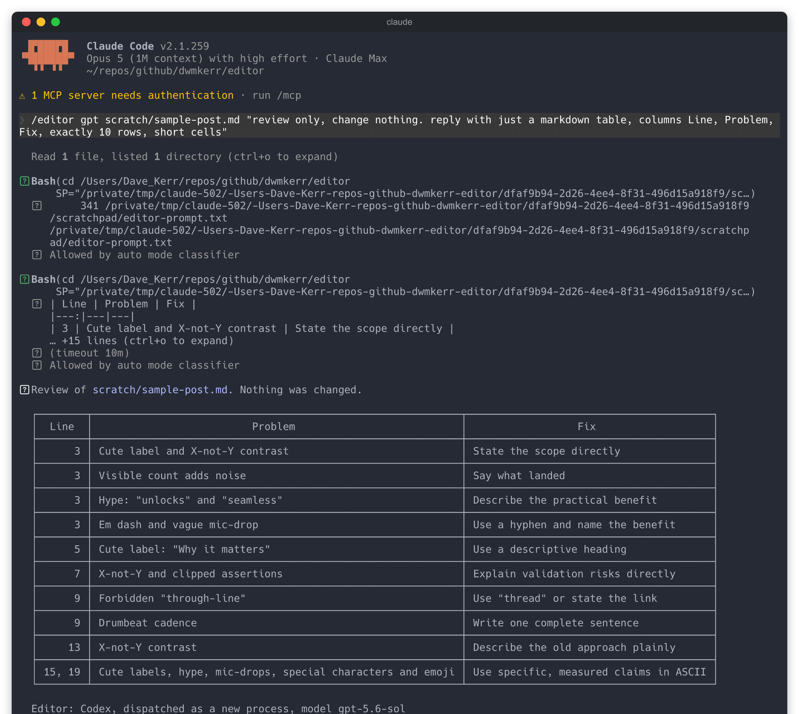

# editor

This repo documents the most egregious patterns out of AI writing. "Claudish" in particular is terrible for this, you will probably recognise styles like this:

- [**Obnoxious humility**](./references/obnoxious-humility.md) - contritness or commentary about honesty, fault or self-correction that adds no useful information: "There was a bug. **I have to be honest with you - that was my fault and the kind I least like.**"
- **X-not-Y** - contrast used for punch where a plain statement is clearer: "It should provoke feedback, not look finished."
- **Drumbeat cadence** - stacked fragments that read like a trailer: "One harness, two models, blind cross-review. Half-day timebox."
- [**Cute labels**](./references/cute-labels.md) - a bolded tag standing in for the point (unless explicitly confirmed in a case such as this list).
- **Mic-drop closers** - a short line asserting a universal truth to end a section: "That is where the real learning happens."
- **Hype words** - unlock, supercharge, seamless, transform, 10x.
- **Characters you cannot type** - em dashes, curly quotes and arrows in place of `-`, `"` and `->`.

You can point your agent at this project to help it reduce noise and make output more readable to actual human beings or AI that cares. You can also just install this as a skill.

It is important to note that by default if you are using Claude Code the skill will try to route through Codex + GPT (which seems to apply a plain and simple writing style more effectively, Claude models seem to have these styles really baked in). All of this behaviour can be customised.

My suggestion is to read through the skill, play with it, then fork it or write your own. The rules in `references/` are mine, so treat them as a starting point for yours. Contributions are welcome when they help everyone, such as a new harness integration in `dispatch.sh` or a guideline that applies regardless of who is writing.

## Before and after example

| Before | After |
|--------|-------|
| **The change that matters most.** We shipped the new ingest path, not a rewrite. Three things landed: batching, retries, backpressure. This unlocks a seamless experience for downstream teams -- and that is where the real win is. | We shipped the new ingest path by extending the existing code. It adds batching, retries and backpressure, so downstream teams no longer have to handle partial batches themselves. |

The before column uses most of the patterns above. The bolded opener is a cute label doing the work a sentence should do. "not a rewrite" is X-not-Y. "Three things landed" counts a list the reader can see, and the three nouns after it are drumbeat cadence. "Unlocks" and "seamless" are hype. The dash would be an em dash in the original. The closing clause is a mic-drop, and it disappears once the actual benefit is stated.

## Install

```sh
npx skills add dwmkerr/editor --full-depth
```

## More Examples

A model that has written a file may overlook problems when reviewing its own work. This skill sends the file and my writing-style rules to another model. It returns either a list of issues or an edited version.

- **Review mode** - say "review", "check", "list", or "don't rewrite" to get a numbered list of issues. Each item includes the line, the problem and a suggested fix. The file is left unchanged.
- **Edit mode** - for other instructions, the skill rewrites the file and shows you a short summary before saving it.
- **Quick mode** - `/editor quick` cleans the file in the current session with whatever model is running. It fixes the clearest violations and leaves the rest, so use it on low-stakes copy or when you want a fast pass.
- **Choose a model** - `gpt` (the default), `luna` and `o3` run in a new process through Codex. `claude` runs in the current session.

```text
/editor "review this README, don't rewrite -- just tell me what's wrong"
/editor "clean this up"
/editor claude "simplify section 6"
```

The screenshot at the top of this page is a review of a sample file written with all of these patterns in it.

Every response ends with the harness and model that did the work, such as `Editor: Codex, dispatched as a new process, model gpt-5.6-sol`, so you can see what produced the response.

The style rules and before-and-after examples live in `references/`. These references give each review the same criteria.

## WTF skill

`/wtf` is a separate skill that re-explains the previous message in short, plain English without adding anything. The `--full-depth` install option discovers both `editor` and `wtf`.

> "The bifurcation of authoritative and recursive resolution semantics, compounded by TTL-governed cache persistence, produces temporally heterogeneous DNS convergence."

becomes

> DNS changes do not take effect everywhere at once. DNS servers keep copies for a fixed time, so some still have the old record after others have the new one.

## Customisation

Machine-specific setup, such as an API key, goes in a `dispatch.local.sh` that `dispatch.sh` sources and the repo ignores. See
[docs/customisation.md](./docs/customisation.md).

## Fixing Output style

This skill works on a file. To apply the same conventions to every response, use an output style. In Claude Code, run `/config` and pick one. Claude Code puts the output style in the system prompt, which is generally more reliable than the same instruction in `CLAUDE.md`.

Ask for the writing you want:

- "Explain it like I'm five. Lead with the answer, then give the detail."
- "Use ASD-STE100 simplified technical English. No jargon, and define any acronym you do use."
- "Answer in five sentences or fewer unless I ask for more."

Install a basic output style based on the conventions in the skill:

```sh
# Ensure we have a Claude Code output style directory.
mkdir -p ~/.claude/output-styles

# Download the dwmkerr-editor output style.
curl -o ~/.claude/output-styles/dwmkerr-editor.md \
  https://raw.githubusercontent.com/dwmkerr/editor/main/references/output-style.md
```

Then run `/config`, select **Output style** and pick `dwmkerr editor`. The style is read at session start, so it applies after `/clear` or in the next session.

The file sets `keep-coding-instructions: true`, which keeps Claude Code's built-in software engineering instructions in place while the style changes the tone. A custom style drops those instructions by default.

The style says nothing about length, since some answers need to be long. When one comes back too dense, run `/wtf`.

If the style is missing or does not take effect, see [troubleshooting](./docs/troubleshooting.md).

## Developer guide

Install the current checkout to apply local edits immediately:

```sh
# Install to every agent found on the machine.
npx skills add . --global --all --full-depth

# Or pick the agents yourself, interactively or by name.
npx skills add . --global --full-depth
npx skills add . --global --agent claude-code codex --full-depth
```

`npx skills` installs to whichever agents it detects - Claude Code, Codex, Cursor, Gemini CLI, GitHub Copilot, OpenCode and Warp among them. `--all` installs every skill for every detected agent without prompting. Drop `--global` to install into the current project instead of the user directory.

Re-run the same command to update after a change. To uninstall, run `npx skills remove --global editor wtf`.

Run the checks and rebuild the hero image with:

```sh
make test    # structural checks
make hero    # rebuild .github/assets/hero.gif (needs vhs)
```

## See also

- [More tools and skills by dwmkerr](https://skills.sh/dwmkerr)
- [claude-toolkit](https://github.com/dwmkerr/claude-toolkit), the original home of this skill
- [slides](https://github.com/dwmkerr/slides), a sibling standalone skill
- [Opus 5 is driving people nuts. Anthropic gave the fix](https://youtu.be/HH6QqWyXJu8), where the output style approach comes from
